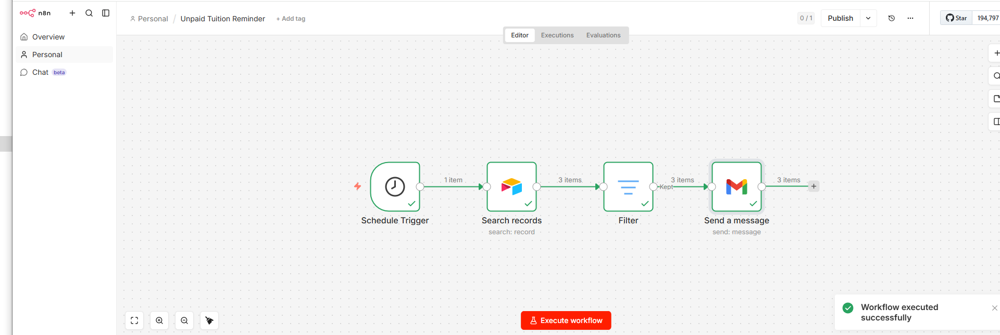

# 🎓 Automated Tuition Reminder System

An intelligent workflow built with **n8n** that automatically identifies students with outstanding tuition fees and sends personalized reminder emails, helping educational institutions reduce manual administrative work and improve payment collection.

---

## 📌 Overview

Educational institutions often spend valuable time manually checking payment records and following up with students who have unpaid tuition.

This workflow automates the entire reminder process, ensuring timely communication while reducing repetitive administrative tasks.

---

## 🚀 Business Problem

Finance and administration teams often face challenges such as:

- Manual tracking of unpaid tuition
- Time-consuming follow-up processes
- Inconsistent reminder schedules
- Delayed tuition payments
- Increased administrative workload

---

## ✅ Solution

This workflow automatically:

1. Runs on a scheduled interval.
2. Searches Airtable for unpaid tuition records.
3. Filters students with overdue payments.
4. Sends personalized reminder emails through Gmail.

---

## 🛠 Technologies Used

- n8n
- Schedule Trigger
- Airtable
- Filter Node
- Gmail

---

## 🔄 Workflow Overview

```text
Schedule Trigger
        │
        ▼
Search Airtable Records
        │
        ▼
Filter Unpaid Students
        │
        ▼
Send Reminder Email (Gmail)
```

---

## 📷 Workflow Screenshot



---

## 💼 Business Value

- Automates repetitive administrative tasks
- Improves tuition payment collection
- Reduces manual follow-up efforts
- Ensures consistent communication with students
- Saves valuable staff time

---

## ✨ Key Features

- Automated scheduled execution
- Airtable database integration
- Intelligent filtering of overdue records
- Personalized Gmail notifications
- Reliable and scalable workflow

---

## 🎯 Skills Demonstrated

- Workflow Automation
- Business Process Automation
- n8n Development
- Airtable Integration
- Gmail Integration
- Data Filtering
- Scheduled Automations

---

## 📂 Repository Structure

```text
.
├── assets
│   ├── docs
│   └── screenshots
│       └── workflow-overview.png
├── workflow.json
└── README.md
```

---

## 🚀 Future Improvements

- SMS payment reminders
- WhatsApp notifications
- Payment status dashboard
- Automatic payment confirmation
- Multi-language support
- Integration with payment gateways

---

## 👨‍💻 Author

**Samuel Favour**

AI Automation Specialist

GitHub: https://github.com/SamFavour-Lab

---

### ⭐ If you found this project helpful, consider giving the repository a star.
